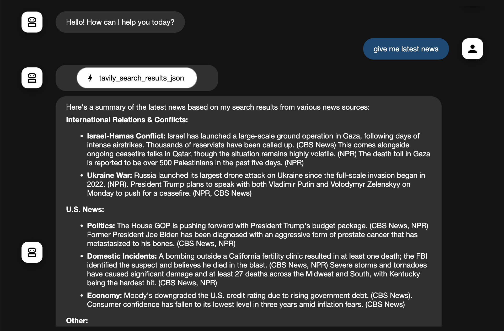

# News Agent for US Tariffs 📰✈️

## Introduction 🌟

Welcome to the News Agent project! This Python application leverages the Google Agent Development Kit (ADK) and Tavily Search to provide up-to-date information on US tariffs. It’s designed to fetch recent news articles from reputable sources (like Reuters and The New York Times) and deliver concise, structured summaries on tariff-related topics, such as rates, affected countries, and economic impacts. Whether you’re curious about US-China trade talks or global trade reactions, this agent has you covered! 🚀
This project is perfect for developers, researchers, or anyone interested in building an AI-powered news assistant. It’s built to run on an Amazon Linux EC2 instance or any Python environment with the required dependencies. Let’s dive in! 😄

## Features ✨

Real-Time News Search: Uses Tavily Search to fetch the latest articles on US tariffs from trusted sources like Reuters, NPR, and The Guardian.

Intelligent Summaries: Extracts key details (e.g., tariff percentages, economic impacts) and presents them in a clear, concise format.

Asynchronous Processing: Built with asyncio for efficient, non-blocking query handling.

Error Handling: Robust logging and validation for API keys and query processing.

Interactive Mode: Supports both single-query execution and an interactive loop for continuous user input.

Customizable: Easily extendable to include more tools or modify the agent’s instructions.

## Prerequisites 🛠️

To run this News Agent, ensure you have:

 *Python 3.8+* installed.

## API Keys:

Tavily API Key: For news search functionality. Get one at Tavily.

Google API Key: For the Google ADK. Obtain it from Google Cloud or relevant Google services.

## Dependencies:
1.python-dotenv: For loading environment variables.

2.google-adk: Google’s Agent Development Kit.

3.langchain-community: For integrating Tavily Search.

4.Install dependencies using: *pip install python-dotenv google-adk langchain-community*

## Setup ⚙️

1.Clone or Create the Project:

2.If using a Git repository, clone it:*cd /home/ec2-user git clone <repository-url>*

3.Or create a new directory:mkdir /home/ec2-user/news-agent
cd /home/ec2-user/news-agent*

4.Set Up Environment Variables:Create a .env file in the project directory:
nano .env

5.Add:
*TAVILY_API_KEY=your-tavily-api-key*

*GOOGLE_API_KEY=your-google-api-key*

6.Save and exit (Ctrl+O, Enter, Ctrl+X).

7.Save the Script:Save the provided Python script as news_agent.py:
*nano /home/ec2-user/news-agent/news_agent.py*

8.Paste the script content (from from dotenv import load_dotenv to asyncio.run(main())), save, and exit.

## Usage 🚀

Single Query
Run the script with a default query:
cd /home/ec2-user/news-agent
python3 news_agent.py

This executes the example query: "What is the latest on US tariffs?"
Interactive Mode
To ask multiple questions interactively:

Uncomment the asyncio.run(main()) line in news_agent.py and comment out asyncio.run(call_agent(query)).

Run:python3 news_agent.py

Enter queries (e.g., “What are the latest US tariffs on China?”) or type exit to quit.

'''Example Output:'''
News Agent is running. Type 'exit' to quit.
Ask about US tariffs, e.g., 'What is the latest on US tariffs?'

You: What is the latest on US tariffs?

>>> You: What is the latest on US tariffs?

<<< Agent: According to recent articles from Reuters, the US imposed a 25% tariff on $200 billion of Chinese goods in 2024, with ongoing trade talks aiming to reduce tensions. The New York Times reports a 10% increase in consumer goods prices due to these tariffs. Negotiations with the EU are set for December 2025.

## File Structure 📂
/home/ec2-user/news-agent/

├── news_agent.py  # Main script for the news agent

├── .env           # Environment variables (TAVILY_API_KEY, GOOGLE_API_KEY)

## Troubleshooting 🐞

API Key Errors:

Ensure .env contains valid TAVILY_API_KEY and GOOGLE_API_KEY.

Verify API keys in the Tavily and Google consoles.

Dependency Issues:
Run *pip3 install -r requirements.txt* if you create a requirements.txt with:*python-dotenv*

*google-adk*

*langchain-community*

## Extending the Agent 🚧

Add More Tools: Integrate additional Langchain tools (e.g., for database access or other APIs).

Custom Instructions: Modify the instruction in root_agent for different topics or response styles.

Web Interface: Extend with a Flask or FastAPI server to expose the /flights endpoint (or new endpoints) via HTTP.

