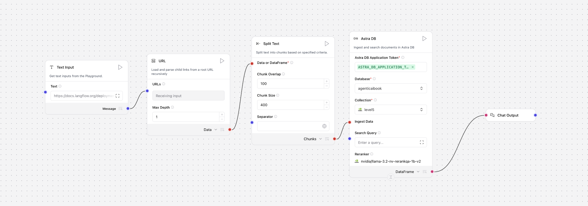
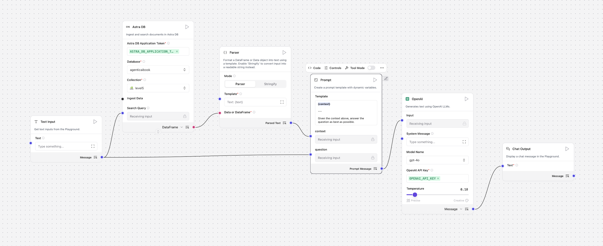

# Level 4: Retrieval-Augmented Generation (RAG) Pipeline with Langflow

This level demonstrates how to build a **Retrieval-Augmented Generation (RAG)** pipeline using Langflow. The solution is split into two main flows:

- **Ingestion Pipeline**: Loads and indexes content into a vector store (Astra DB).
- **Retrieval Pipeline**: Answers user questions by retrieving relevant context from the vector store and passing it to an LLM.

---

## 1. Ingestion Pipeline

**Purpose:**
- To process and ingest documents (from URLs or text) into a vector database for later retrieval.

**Key Components:**
- **TextInput / URLComponent**: Accepts raw text or URLs to fetch content.
- **SplitText**: Splits large documents into manageable chunks for embedding.
- **AstraDB**: Stores the vectorized document chunks for semantic search.
- **ChatOutput**: Displays confirmation or status messages.

**Flow Diagram:**

**How it works:**
1. User provides text or a URL.
2. The content is split into smaller chunks.
3. Each chunk is embedded and stored in Astra DB as a vector.
4. The system confirms successful ingestion.

---

## 2. Retrieval Pipeline

**Purpose:**
- To answer user questions by retrieving relevant context from the vector store and using an LLM to generate answers.

**Key Components:**
- **TextInput**: Accepts the user's question.
- **AstraDB**: Performs a similarity search to retrieve relevant document chunks.
- **Parser**: Formats the retrieved context for the prompt.
- **Prompt**: Combines the context and question into a prompt template.
- **OpenAIModel**: Calls the LLM (e.g., GPT-4) to generate an answer.
- **ChatOutput**: Displays the answer to the user.

**Flow Diagram:**

**How it works:**
1. User asks a question.
2. The question is sent to Astra DB, which retrieves the most relevant document chunks.
3. The retrieved context is parsed and formatted.
4. A prompt is constructed with both the context and the question.
5. The prompt is sent to the LLM, which generates an answer.
6. The answer is displayed to the user.

---

## RAG Pattern Overview

**Retrieval-Augmented Generation (RAG)** combines the strengths of information retrieval and generative AI:
- **Retrieval**: Finds relevant information from a large corpus (vector store).
- **Augmentation**: Supplies this information as context to the LLM.
- **Generation**: The LLM uses both the context and the question to generate accurate, grounded answers.

This approach enables the system to answer questions based on up-to-date or domain-specific knowledge, even if the LLM was not trained on that data.

---

## Practical Notes
- **Astra DB** is used as the vector store backend, but you can swap in other vector databases supported by Langflow.
- The flows are modular: you can extend the ingestion pipeline to support more data sources, or the retrieval pipeline to use different LLMs or prompt templates.
- The provided diagrams (`output/ingest_content.png` and `output/retrieve_from_vector_store.png`) visually summarize each flow.

---

**Next Steps:**
- Try ingesting your own documents and asking questions about them!
- Experiment with different chunk sizes, embedding models, or prompt templates for improved results.
